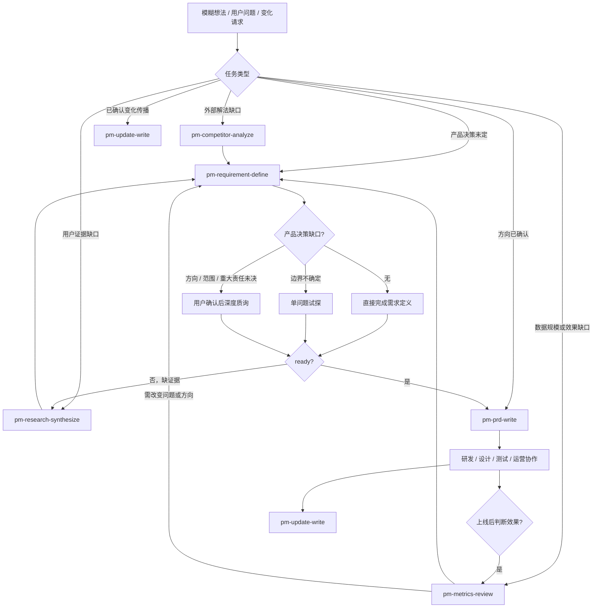

# PM Workflow Skills 使用与协作指南

> 维护状态：2026-08-05 · 基线：`c841325` · 适用对象：产品、设计、研发、测试、运营、管理者及调用本仓库 skills 的 AI

这份文档是仓库级操作指南。`README.md` 负责快速了解项目；各 skill 的 `SKILL.md` 负责运行规则；本指南负责说明如何选择、串联、交接和维护整套工作流。

## 目录

1. [先判断要解决什么](#1-先判断要解决什么)
2. [工作流总图](#2-工作流总图)
3. [Skill 选择与交付物](#3-skill-选择与交付物)
4. [上下游交接契约](#4-上下游交接契约)
5. [三种执行模式](#5-三种执行模式)
6. [深度质询如何参与](#6-深度质询如何参与)
7. [不同协作方读什么](#7-不同协作方读什么)
8. [当前完备度评估](#8-当前完备度评估)
9. [资源索引](#9-资源索引)
10. [AI 执行与维护规则](#10-ai-执行与维护规则)

## 1. 先判断要解决什么

先区分任务属于哪一类，不要看到“产品”“需求”就默认写 PRD：

| 用户真正要解决的事 | 首选 skill | 关键输出 |
|---|---|---|
| 想法、提需、方向或范围还没有定 | `pm-requirement-define` | 产品需求定义简报 |
| 用户问题和根因不清楚 | `pm-research-synthesize` | 研究洞察、反例和问题机会 |
| 外部解法和差异化空间不清楚 | `pm-competitor-analyze` | 竞品 / 替代方案证据和适用性建议 |
| 问题规模、上线效果或异常原因不清楚 | `pm-metrics-review` | 数据事实、原因假设和行动条件 |
| 方向已经确认，需要落地规格 | `pm-prd-write` | 可评审、可实现、可验收的 PRD |
| 已确认变化需要同步、执行或留档 | `pm-update-write` | 更新说明、变更通知或更新日志 |

“缺信息”不是一个足够具体的判断。先区分它是事实、证据、产品决策、PRD 规格还是研发实现缺口，再选择动作。

## 2. 工作流总图



这不是固定瀑布流程。证据类 skills 可以在需求定义前独立使用，也可以只在需求定义发现缺口时调用。

## 3. Skill 选择与交付物

### `pm-requirement-define`

**使用时：**问题、目标、方向、一级范围或重大取舍尚未确认。

**不使用时：**仅缺页面规格、接口字段、研发实现，或只是传播已确认结论。

**交付：**问题、目标、非目标、方向比较、一级范围、成功假设、重大约束和成熟度。

### `pm-prd-write`

**使用时：**已经有 `ready` 的需求定义或等价产品决策输入。

**不使用时：**还在争论为什么做、为谁做、哪个方向或做到哪里。

**交付：**用户路径、页面 / 信息结构、功能行为、状态权限、异常、联动、发布、验收、指标和 spec 交接。

### `pm-research-synthesize`

**使用时：**已有访谈、工单、问卷、观察或可用性材料，需要综合出用户问题和机会。

**不使用时：**只有一个未经验证的想法，或用户只是要摘要材料。

**交付：**证据单元、分群、主题、反例、证据强度、问题机会和后续验证动作。

### `pm-competitor-analyze`

**使用时：**需要比较外部解法、替代方式，或拆解某个产品机制支持具体决策。

**不使用时：**只是收集功能清单，或没有要支持的产品决策问题。

**交付：**统一任务 / 机制问题、证据台账、差异原因、适用前提和 `adopt / adapt / avoid / test` 建议。

### `pm-metrics-review`

**使用时：**需要解释指标表现、上线结果或异常波动。

**不使用时：**指标口径和数据源都不清楚，且用户只是要报表罗列；此时先输出数据风险。

**交付：**指标树、口径、数据质量、对照、拆解、原因假设、护栏和行动条件。

### `pm-update-write`

**使用时：**产品结论、范围、规则、上线状态或项目进展已经确认，需要让特定受众知晓或执行。

**不使用时：**需要重新讨论产品方向，或需要写 PRD / 技术提交日志。

**交付：**背景、变化、不变项、影响、生效、行动项、风险和资料入口。

## 4. 上下游交接契约

### 需求定义 → 证据增强

交接至少说明：

- 当前要支持的产品决策问题
- 已知事实与当前假设
- 需要补的证据类型
- 证据回来后可能改变什么决策
- 本次不研究什么

### 证据增强 → 需求定义

不要直接交一份新的产品方案，交回：

- 一句话证据结论
- 证据索引和强度
- 适用用户 / 场景
- 反例、冲突和局限
- 对问题、目标、方向或范围的影响
- 建议的下一验证动作

### 需求定义 → PRD

至少交付：

- 已确认问题及依据
- 目标、非目标和成功假设
- 推荐方向、选择依据和未选方案
- 一级范围、主要角色、入口和主任务
- 重大约束、阻塞决策处理结果
- PRD 需要展开的页面、状态、权限、规则、联动和数据维度
- 需要研发 spec 补齐的能力方向，而不是接口字段和实现参数

### PRD → 研发 / 设计 / 测试 / 运营

PRD 是单一事实来源。各方可以读取不同章节，但不能各自创造一套规则：

- 设计：方案总览、动线、信息结构、原型索引、状态矩阵
- 研发：功能需求、系统能力、规则质量边界、依赖、验收、spec 交接
- 测试：功能需求、规则 / 异常矩阵、Given / When / Then、追溯矩阵
- 运营：影响与发布、兼容、配置、人工处置、已知限制
- 管理者：一页结论、决策依据、范围、取舍、风险和待决策项

### 上线结果 → 指标复盘 / 需求定义

- 只是判断效果：进入 `pm-metrics-review`
- 发现问题规模、用户行为或异常原因：先补指标 / 研究证据
- 结果要求改变问题、目标、方向或一级范围：返回 `pm-requirement-define`

## 5. 三种执行模式

### 快速模式

适合低风险、小范围、目标和方向已经明确的任务：

- 读取最小必要材料
- 不启动深度质询
- 只补会阻塞当前交付的一个问题
- 输出轻量需求定义、PRD 或更新材料

### 标准模式

适合普通新功能和版本迭代：

- 完成输入成熟度判断
- 按证据缺口调用一个或多个增强 skill
- 形成需求定义后再写 PRD
- 按条件补齐状态、异常、验收和指标

### 深度模式

适合方向未定、跨系统、高风险、多个方案冲突或资料需要长期复核的任务：

- 需求定义先经过单问题试探或用户确认后的深度质询
- 竞品分析按需建立 `raw → notes → merged` 研究底稿
- PRD 使用组合输出结构和完整追溯矩阵
- 指标复盘补充分群、漏斗、护栏和决策门

## 6. 深度质询如何参与

深度质询只处理产品决策缺口，不处理所有“没写完”的内容。

判断顺序：

1. 先读取可查事实。
2. 再分类缺口。
3. 判断硬触发和软信号。
4. 边界不确定时只问一个高信息量问题。
5. 多轮质询前向用户解释原因和范围。
6. 每轮重新判断是否继续。
7. 达到 `ready` 或剩余事项已路由给下游后停止。

详细问题格式、决策记录、禁止事项和回归案例见：

- [深度质询协议](./skills/pm-requirement-define/references/深度质询协议.md)
- [深度质询触发回归案例](./skills/pm-requirement-define/references/深度质询触发案例.md)

## 7. 不同协作方读什么

| 协作方 | 首先读 | 重点确认 |
|---|---|---|
| 产品负责人 | 需求定义简报、PRD 一页结论、决策依据 | 问题、目标、方向、范围和取舍 |
| 设计 | PRD 方案总览、动线、信息结构、原型索引 | 页面结构、用户路径、状态和反馈 |
| 研发 | PRD 功能需求、系统能力、规则质量边界、spec 交接 | 能力、约束、异常、依赖和实现待补事项 |
| 测试 | PRD 规则、异常、验收和追溯矩阵 | 条件、动作、结果、回归和护栏 |
| 运营 | PRD 发布、兼容、配置、人工处置和更新说明 | 生效范围、用户沟通、已知限制和行动项 |
| 管理者 | 一页结论、方向取舍、风险和待决策项 | 价值、投入、风险、依赖和是否继续 |

## 8. 当前完备度评估

截至本指南维护版本：

| Skill | 当前判断 | 已经足够成熟的部分 | 仍需关注的边界 |
|---|---|---|---|
| `pm-requirement-define` | 核心成熟 | 决策入口、深度质询、证据路由、成熟度、范围和 PRD 交接 | 真实使用中继续校准质询误触发和漏判 |
| `pm-prd-write` | 核心成熟 | 组合输出、行为规格、状态权限、异常、追溯、验收、发布和 spec 边界 | 复杂需求要按条件裁剪，不能默认生成全量结构 |
| `pm-research-synthesize` | 方法成熟 | 证据单元、编码、分群、反例、强度和不能下的结论 | 样本质量和研究问题必须由项目负责，不能靠模板补足 |
| `pm-competitor-analyze` | 方法成熟 | 统一任务、单品机制、深度采集、证据回溯和适用性建议 | 依赖真实体验 / 外部来源，不能把公开资料当业务结果 |
| `pm-metrics-review` | 方法成熟 | 数据质量、对照、拆解、原因等级、护栏和行动门 | 相关性不能自动升级为因果，数据口径变化要优先阻塞解释 |
| `pm-update-write` | 有意轻量 | 受众适配、变化 / 不变、影响、生效和行动项 | 不应承担方向决策或 PRD 规格，必要时回到上游文档 |

“成熟”表示结构和边界可稳定复用，不表示没有项目事实就能自动产出正确结论。

## 9. 资源索引

| 资源 | 作用 |
|---|---|
| `README.md` | 快速选择和仓库原则 |
| `WORKFLOW_GUIDE.md` | 本文，完整使用、协作和交接指南 |
| `shared-references/产品方案六问.md` | 跨 skill 的论证主线和质量门 |
| `ITERATION_GUIDE.md` | 真实使用反馈、回归和迭代方法 |
| `upstream-mapping/anthropic-product-management-mapping.md` | 上游能力、外部取舍和当前映射 |
| `commands/pm-requirement-define.md` | 需求定义的快捷入口 |
| `skills/*/SKILL.md` | 各 skill 的运行规则 |
| `skills/*/references/*模板.md` | 运行时产物模板 |
| `skills/*/references/*示例.md` | 参考粒度和表达方式 |
| `scripts/validate-skills.sh` | skill 结构和元数据校验 |
| `scripts/validate-docs.py` | 链接、表格、必备章节和文档关系校验 |

## 10. AI 执行与维护规则

AI 调用本仓库 skills 时：

- 先选择工作类型和 skill，不要并行生成互相竞争的产品方案。
- 先读取项目规则、事实和已有决策，再决定是否需要提问或补证据。
- 重要结论区分已确认事实、用户陈述、推断、AI 建议和待验证假设。
- 需要改变问题、目标、方向、范围或重大责任时，必须返回需求定义，不在 PRD 或更新说明中静默改写。
- 产物输出后按目标协作方裁剪，但不创造第二套事实来源。
- 质询、研究、竞品和指标分析达到停止条件后停止，不为填模板继续扩展。
- 修改 skills 时同步维护模板、示例、README、交接文档和回归案例。

提交前执行：

```bash
bash scripts/validate-skills.sh
python3 scripts/validate-docs.py
```

真实使用问题按 [ITERATION_GUIDE.md](./ITERATION_GUIDE.md) 记录，先判断是触发、流程、模板、交接、项目上下文还是单次表达问题。
